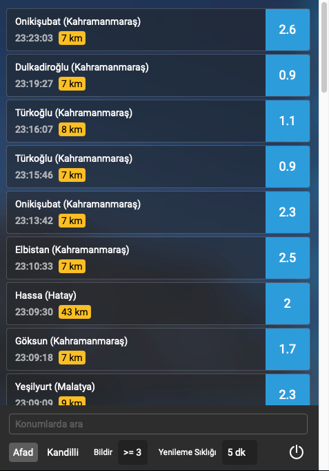

# Afad ve Kandilli Rasathanesi Son Depremler Uygulaması (crossplatform)

- Frontend: Nuxt 3
- Backend: Rust (Tauri)

## Özellikler

- Bildirimler depremlerin şiddetine göre özelleştirilebilir.
- Yenileme sıklığı özelleştirilebilir.

## Uygulama
- [Windows x64](https://github.com/assoft/tauri-nuxt3-earthquakes/releases/download/v0.0.3/Earthquakes.Tracker_0.0.1_x64_en-US.msi)
- [MacOS](https://github.com/assoft/tauri-nuxt3-earthquakes/releases/download/v0.0.3/Earthquakes.Tracker_0.0.1_x64.dmg)

<div align="center">
     
</div>

# Develoment

## Setup

Make sure to install the dependencies:

```bash
# yarn
yarn install

# npm
npm install

# pnpm
pnpm install
```

## Development Server

Start the development server on http://localhost:3000

```bash
npm/yarn/pnpm tauri dev
```

## Production

Build the application for production:

```bash
npm/yarn/pnpm run tauri build
```
